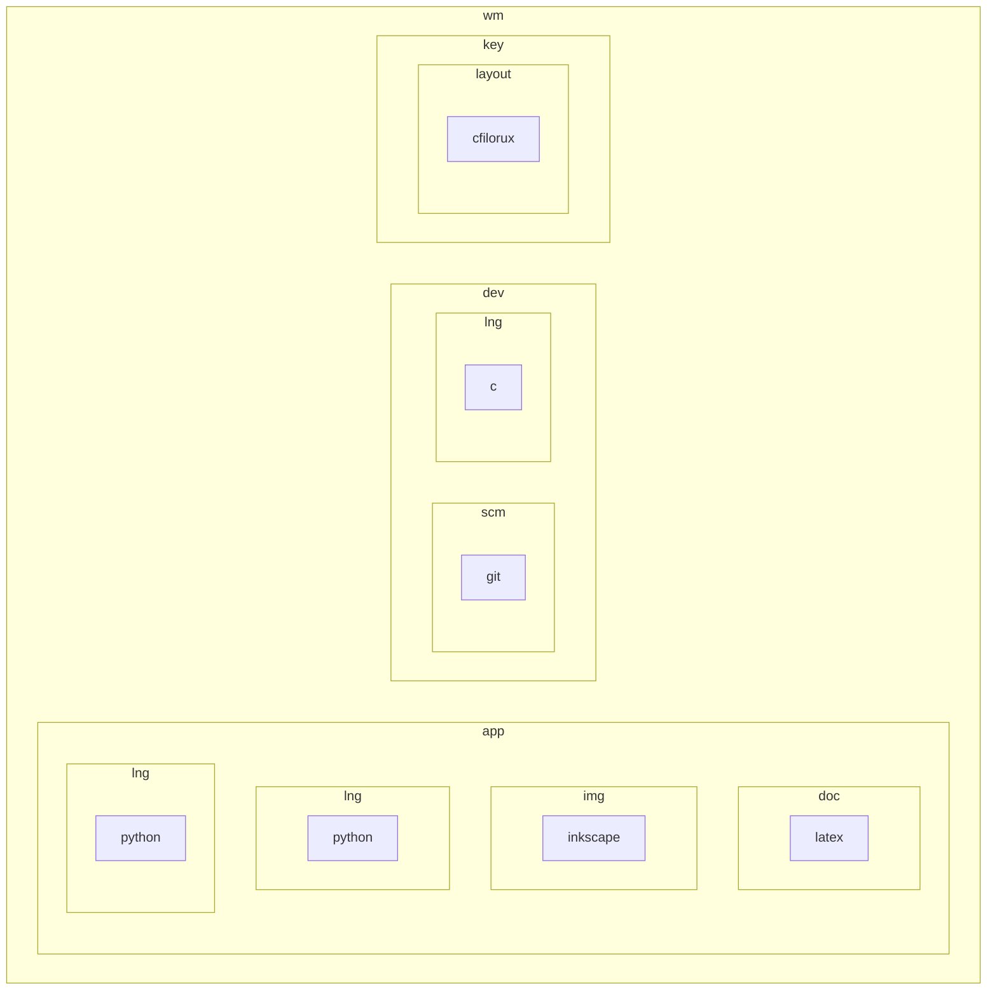

# wenuam

Meaningful development studio with a mindset.

Software architecture, project management, embedded system.

## Repositories



The naming convention is from general to specific :

```wm_key_name(__impl)```

* wm : wenuam's compact form
* key : 2 or 3 chars for the section
* name : repository name or subsection (may be like key)
* __impl : specific implementation (optional)

Some repositories may be used in another as submodule, often using only their name with no prefix.

Such repositories may not keep a complete history and scrub old binaries, pulling must be forced.

### Keys

Repository keys are as follow (non exhaustive) :

<details>
<summary>Keys</summary>
<p>

| key	| Explanation						|
| :---	| :---								|
| app	| Applications, portable or not		|
| com	| Communication buses				|
| db	| Database							|
| dev	| Development tools and libraries	|
| doc	| Documentation						|
| emu	| Emulation							|
| img	| Image 							|
| key	| Keyboard layout and mapping		|
| lng	| Programming and natural languages	|
| net	| Network protocols					|
| os	| Operating system					|
| pcb	| Electronic and related			|
| prj	| Project							|
| scm	| Source Code Management			|
| snd	| Sound								|
| sys	| System							|
| txt	| Text								|
| ui	| User interface, graphic or not	|
| vid	| Video								|
| web	| Internet							|

</p>
</details>
